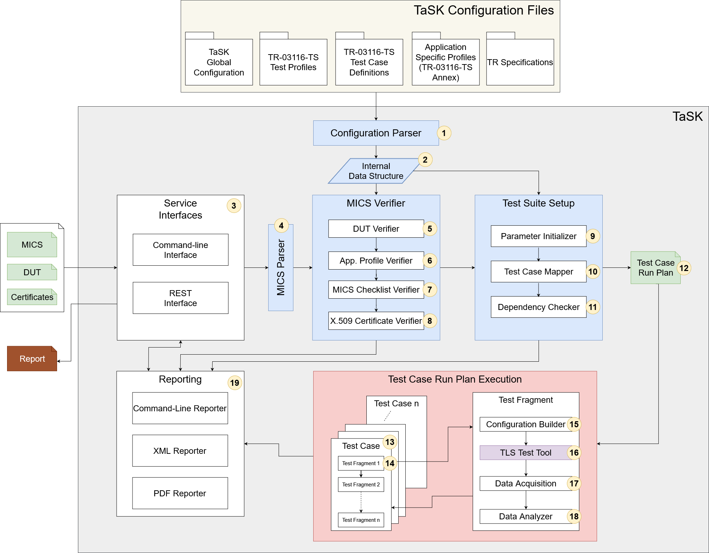

# TaSK Framework
The "TaSK Framework" is a configurable test tool for performing TLS conformity tests based on the Technical Guideline [TR-03116-TS](https://www.bsi.bund.de/SharedDocs/Downloads/EN/BSI/Publications/TechGuidelines/TR03116/BSI-TR-03116-TS_v1.pdf).
The test tool has a modular structure to enable efficient further development and applicability in different test scenarios.
This testing tool enables test centers to efficiently and effectively test various DUTs from different application-specific scenarios for conformity.
Furthermore, it offers manufacturers the possibility to perform independent tests during development.
In the case of TLS implementations, the test tool itself checks both the manufacturer's specifications and direct conformity with the BSI's technical guidelines.

## 1 Structure
The framework consists of two components: "TaSK" and "TLS Test Tool".

### 1.1 TaSK
The test case runner with report generator and validation mechanism for the input documents.
It is started via a command line interface and can be executed locally or via a REST API. The configuration is done via XML files which are explained later in this document.

### 1.2 TLS Test Tool
The TLS test tool is a stand-alone application that is capable of performing different TLS handshakes and apply manipulations on the TLS communication. It is used in the background by TaSK.
Depending on the type of the DUT and the test-scenario, it can act as a TLS client or a TLS server.

### 1.3 Overview TaSK Framework Modules
The TaSK framework has been designed to be modular. The numbered circles in the figure represent the order of the workflow.



Several *configuration files* are directly derived from the specification TR-03116-TS and need not to be edited. But the user must set the values in the global configuration files according to the test environment.

The *MICS verifier* checks the manufacturer's specification for plausibility.

Once the MICS verification has successfully been completed, the *test suite setup* module can start generating the *test case run plan* (TRP). The TRP is a self-contained XML file that contains a list of test cases to be executed along with all the required parameters and dependencies. Only test cases determined by the application profile will be executed. The test cases are independent from each other and do not rely on a specific execution order unless a dependency has been explicitly specified in the test case description.

The TRP is then used as input to the *test case execution*. The test cases are executed sequentially one after another as specified in the TRP and the results are captured. To improve code reuse, the test cases have been functionally divided into smaller blocks, namely test fragments.


## 2 Building the Framework
The build of the TaSK framework is done using [Apache Maven](https://maven.apache.org/).

The build can be executed via the command line, e.g.

```bash
cd ./task
mvn clean install
```

### 2.1 System Requirements for Building
The following system requirements should be met when trying to build the TaSK framework:
- Operating System: x86-64 Linux Distribution (e.g. [Ubuntu 20.04](https://ubuntu.com/download/desktop) or [Debian 10](https://www.debian.org/index.de.html)).
- Java Version: JDK 17 (or potentially newer, e.g. [OpenJDK 17](https://openjdk.java.net/projects/jdk/17/))
- Apache Maven 3.8.5 (or potentially newer, e.g. from [here](https://maven.apache.org/))

### 2.2 Generation of JavaDocs
After the build of the TaSK Project has been successfully executed, the corresponding JavaDocs are available at each modules target directory.
To aggregate the JavaDocs into one single location, the following call to Maven can be executed via the command line.
```bash
mvn org.apache.maven.plugins:maven-javadoc-plugin:aggregate-no-fork
```
As a result, the JavaDocs will be aggregated at `task/target/site/apidocs`.

## 3 Execution
This chapter explains how the TaSK framework can be executed and configured. A command line interface is provided to the user as described in the following chapter.

### 3.1 Command Line Interface
The TaSK framework provides a command line interface to the user, which can be used to run the test framework.
After the build process, the command line interface JAR can be found in the `com.achelos.task.commandlineinterface/target` directory under the name `com.achelos.task.commandlineinterface-<version>-jar-with-dependencies.jar`.

The command line interface can be called in the following way:

```bash
java -jar com.achelos.task.commandlineinterface-<version>-jar-with-dependencies.jar <arguments>
```

The following options are available to use as arguments for running the CLI:

`-c <arg>, --config-file <arg>`   
*Required*   
The path to the global configuration XML file.

`-d <arg>, --certificate-directory <arg>`   
*Required if CHECK_CERTS Profile is set in MICS. Otherwise optional.*   
The path to a directory with certificates in either DER or PEM encoding.

`-g, --debug`   
*Optional*   
Print additional debug information to the console

`-i, --ignore-mics-verification`   
*Optional*   
Ignore the result of the MICS verification when running the resulting test cases.

`-m <arg>, --mics-file <arg>`   
*Required if executed locally and no test run plan is provided*   
The path to a machine-readable ICS file.

`-p, --generate-pdf-report`   
*Optional*   
Generate a PDF report. Also generates the XML report, regardless of whether option `-x` is set.

`-t <arg>, --testrunplan <arg>`   
*Required if executed locally and no MICS is provided*   
The path to a TestRunplan XML file.

`-x, --generate-xml-report`   
*Optional*   
Generate an XML report

`-s, --rest-server`     
*Required if no local execution shall be executed.*      
Flag indicating whether the TaSK framework shall be executed as a REST server.      
*Note: In REST Server mode, only TLS-Server DUTs can be tested*

#### 3.1.1 Execution Modes
During the execution of the TaSK CLI, either a MICS file(`mics-file`), a test run plan file(`testrunplan`),
or the REST server option(`rest-server`) has to be provided. If either the MICS or the test run plan file has been provided, the test run is executed locally.
If the REST server option is set, the TaSK framework is executed as a REST server, and listens for incoming execution requests on the specified network interface.
##### 3.1.1.1 Local Mode
When the TaSK framework is executed locally, all configuration and input data has to be provided via the CLI.
A single test run is executed with the provided information, and the TaSK framework shuts down afterwards.
##### 3.1.1.2 REST Server Mode
If the TaSK framework is executed in REST server mode, an HTTP Server is started and the TaSK framework listens for incoming execution requests.
The provider who runs the TaSK framework server is required to provide the global configuration file via the CLI.
The global configuration file contains parameters for the specification of hostname and port the server should listen to.
A user can execute a test case run, by providing an MICS file or a test run plan file for a DUT of Type TLS-Server via the REST interface.
An OpenAPI v3 conform specification of the REST API can be either found here: [`openapi.yaml`](com.achelos.task.rest-impl/src/main/resources/openapi.yaml)
or retrieved from a running TaSK REST server via a `GET /` request.
A tool like e.g. [Swagger UI](https://swagger.io/tools/swagger-ui/) can be used to visualize the REST API documentation.

### 3.2 System Requirements for Execution
The following system requirements should be met when trying to execute the TaSK framework:
- Operating System: x86-64 Linux Distribution (e.g. [Ubuntu 20.04](https://ubuntu.com/download/desktop) or [Debian 10](https://www.debian.org/index.de.html)).
- Java Version: JRE 17 (or potentially newer, e.g. [OpenJDK 17](https://openjdk.java.net/projects/jdk/17/))
- TLS Test Tool Version: 0.4.1
- Python3 Version: 3.7 (or potentially newer, e.g. [Python3](https://www.python.org/downloads/))
- OpenSSL Version: 3.0.5 (or potentially newer, e.g. [OpenSSL 3.0.5](https://www.openssl.org/source/))

### 3.3 Quick Start
The following steps are meant as a quick start guide. More detailed informations are contained in the following chapters.
1. Make sure the `System Requirements for Execution` are fulfilled.
   1. The TLS Test Tool is available as a separate Source Bundle. For information about the build of the TLS Test Tool have a look at contained `README` file.
2. Copy the exemplary global configuration file [`ExampleGlobalConfig.xml`](data/configuration/ExampleGlobalConfig.xml) to a location of your choice.
   1. Edit your copy of the global configuration by setting all mandatory configuration options as described in the comments of the `ExampleGlobalConfig.xml`.
   2. The specification files are contained in the `data` directory of the TaSK source bundle, and can be used as is.
3. Copy one of the examplary MICS files [`ExampleMICS_Server.xml`](data/input/ExampleMICS_Server.xml), [`ExampleMICS_Client.xml`](data/input/ExampleMICS_Client.xml), [`ExampleMICS_eID-Client-TLS-1-2.xml`](ExampleMICS_eID-Client-TLS-1-2.xml), or [`ExampleMICS_eID-Client-TLS-2.xml`](data/input/ExampleMICS_eID-Client-TLS-2.xml) to a location of your choice.
   1. Edit your copy of the MICS file to contain the required information about the device under test according to chapter 3 of the [TR-03116-TS](https://www.bsi.bund.de/SharedDocs/Downloads/EN/BSI/Publications/TechGuidelines/TR03116/BSI-TR-03116-TS_v1.pdf).
4. If the `CHECK_CERTS` profile is contained in your MICS file, make sure to have the TLS certificate chain of your device under test available as single files in a known location.
5. The TaSK framework can now be executed by the following call:
```bash
java -jar com.achelos.task.commandlineinterface-<version>-jar-with-dependencies.jar
--config-file
/path/to/your/copy/ExampleGlobalConfig.xml
--mics-file
/path/to/your/copy/ExampleMICS.xml
--generate-pdf-report
# If CHECK_CERTS Profile is included
--certificate-directory
/path/to/your/certificates
```

### 3.4 User Input
The user of the TaSK framework has two options of executing the TaSK framework.

1. MICS
  The user can provide a machine-readable version of the ICS document ("MICS").
  If the "CHECK_CERTS" test profile has been set in the MICS, the respective part in the MICS has also to be set and the respective certificate chain has to be provided as an input to the TaSK framework.
  If a MICS is provided and can be successfully verified, the TaSK framework generates a test run plan file to specify the test suite to execute.

1. Test Run Plan
  If an already existing test run plan file is provided, the MICS file and the certificate verification is skipped, and the test suite specified by this test run plan file is executed.

#### 3.4.1 MICS
The Machine-readable Implementation Conformance Statement ("MICS") is an XML file, which includes information about the DUT, provided by the vendor according to chapter 3 of the [TR-03116-TS](https://www.bsi.bund.de/SharedDocs/Downloads/EN/BSI/Publications/TechGuidelines/TR03116/BSI-TR-03116-TS_v1.pdf).
The structure of the MICS file is based on tables 2 to 17 in the document.

The MICS must be conform to `<task-dir>/com.achelos.task.xmlparser/src/main/resources/schemas/input/MICS.xsd` and has to be provided via the CLI as follows:

```bash
java -jar com.achelos.task.commandlineinterface-<version>-jar-with-dependencies.jar <other_arguments> -m /path/to/mics.xml
```

Commented MICS examples:
* `<task-dir>/data/input/ExampleMICS_Client.xml`
* `<task-dir>/data/input/ExampleMICS_Server.xml`
* `<task-dir>/data/input/ExampleMICS_eID-Client-TLS-1-2.xml`
* `<task-dir>/data/input/ExampleMICS_eID-Client-TLS-2.xml`

#### 3.4.2 Certificates
If the "CHECK_CERTS" test profile has been set in the MICS the test cases "TLS_CERT_01" - "TLS_CERT_12" described in the [TR-03116-TS](https://www.bsi.bund.de/SharedDocs/Downloads/EN/BSI/Publications/TechGuidelines/TR03116/BSI-TR-03116-TS_v1.pdf) will be executed by the MICS verifier module.
For that purpose the TLS certificate chain used by the DUT has to be provided to the TaSK framework.

Via the CLI a directory can be specified, which is searched for the respective certificates. Each certificate has to be provided as a separate file, encoded either in PEM or in DER encoding.

```bash
java -jar com.achelos.task.commandlineinterface-<version>-jar-with-dependencies.jar <other_arguments> -d /path/to/certificate/directory
```

#### 3.4.3 Test Run Plan
The TaSK framework uses the provided MICS file to generate a test run plan file. This test run plan file is used to specify a application specific test suite containing the test cases corresponding to the test profiles of the device under test.

Moreover, an already existing test run plan file can be used to rerun the specified test suite from the command line interface.

Via the CLI a test run plan file can be provided as follows:

```bash
java -jar com.achelos.task.commandlineinterface-<version>-jar-with-dependencies.jar <other_arguments> -t /path/to/testrunplan/file.xml
```

### 3.5 Configuration
The configuration of the TaSK framework is also done via a set of XML files. On one hand a "Global Configuration" file is provided, which is used to set a number of options and configurations regarding the general execution of the TaSK framework, e.g. the location of the TLS Test Tool or the name of the Tester in charge.

On the other hand, a collection of XML files is used to represent test cases, application specific profiles, and technical guidelines, which are used as a baseline by the TaSK framework. The schemas for these XML files are contained as resource in the module com.achelos.task.xmlparser

#### 3.5.1 Global Configuration
The global configuration XML file is used by the TaSK framework to specify the general test framework properties to be used.
For example, the name of the tester or test center that should appear in the report, the type of report to generate, or the location of the "TLS Test Tool".

The global configuration XML file must be conform to  `<task-dir>/com.achelos.task.xmlparser/src/main/resources/schemas/configuration/GlobalConfig.xsd` and is provided to the CLI as follows:

```bash
java -jar com.achelos.task.commandlineinterface-<version>-jar-with-dependencies.jar <other_arguments> -c /path/to/global/configuration.xml
```
Commented example: `<task-dir>/data/input/ExampleGlobalConfig.xml`

#### 3.5.2 Application Specifications
The TaSK framework has been designed to be configurable with minimal effort required on behalf of the test center. This means that if an application specific profile or technical guideline needs to be updated in the future, or a new application specific profile or technical guideline needs to be added, it can be done without requiring to modify any code. To achieve this, the TaSK framework uses a collection of XML configuration files during its initialization.
- TR-03116-TS Test Profiles
- TR-03116-TS Test Case Definitions
- Application Specific Profiles
- Technical Guideline Specifications

The root directory of the specification files has to be provided as a global configuration parameter, which includes all of these files in the specified structure:

##### 3.5.2.1 TR-03116-TS Test Profiles
This file specifies all the valid test profiles according to Table 1 in [TR-03116-TS](https://www.bsi.bund.de/SharedDocs/Downloads/EN/BSI/Publications/TechGuidelines/TR03116/BSI-TR-03116-TS_v1.pdf). Profiles are used during the MICS verification process to identify the subset of test cases for the run plan.

The profiles definition file is `<task-dir>/data/specification/TestProfiles.xml`
This XML is conform to `<task-dir>/com.achelos.task.xmlparser/src/main/resources/schemas/configuration/TestProfiles.xsd`


##### 3.5.2.2 TR-03116-TS Test Case Definitions
The BSI has made available all the test case definitions specified in [TR-03116-TS](https://www.bsi.bund.de/SharedDocs/Downloads/EN/BSI/Publications/TechGuidelines/TR03116/BSI-TR-03116-TS_v1.pdf) as a collection of XML files.
These XML files are included in the configuration data and consist of different attributes and elements, however we are only interested in the attributes "id" and the elements "Profile".
This information is used later on in the MICS validation and test suite setup modules to select the test cases that are to be executed based on the application specific profile.

The test case definition files are stored in the directory `<task-dir>/data/specification/TestCases`.
Test case definitions must be conform to the Schema `<task-dir>/com.achelos.task.xmlparser/src/main/resources/schemas/configuration/TestCase.xsd`


##### 3.5.2.3 TR-03116-TS Application Specific Profiles
The test cases defined in [TR-03116-TS](https://www.bsi.bund.de/SharedDocs/Downloads/EN/BSI/Publications/TechGuidelines/TR03116/BSI-TR-03116-TS_v1.pdf) are a collection of different TLS test cases that can be executed for different types of applications.
The decision on the applicability of a particular TLS test case is made based on the specific application at hand. Therefore, in order to execute the TLS test cases, each application (e.g., eID-Client, eID-Server, Smart Metering, E-Mail-Trsp, etc.) must specify which profiles are applicable for it.

These application profiles are specified in the [Annex to BSI TR-03116-TS](https://www.bsi.bund.de/SharedDocs/Downloads/EN/BSI/Publications/TechGuidelines/TR03116/BSI-TR-03116-TS_Annex.pdf).
The profile mappings for these applications have been manually specified in XML configuration files that are then supplied to the TaSK framework.

The application profiles definition files are stored in the directory `<task-dir>/data/specification/ApplicationSpecificProfiles`.
These XML files must be conform to `<task-dir>/com.achelos.task.xmlparser/src/main/resources/schemas/configuration/ApplicationMapping.xsd`


##### 3.5.2.4 TR-03116-TS Technical Guideline Specifications
Each application is mapped to a base specification which is defined in the [Annex to BSI TR-03116-TS](https://www.bsi.bund.de/SharedDocs/Downloads/EN/BSI/Publications/TechGuidelines/TR03116/BSI-TR-03116-TS_Annex.pdf).
However, such a base specification can be derived from multiple specification documents.

Each specification document has been divided into smaller modules and is represented in XML.
Specific modules are then merged together to form the application specification.

Moreover, a specification document can relate to another specification document as a base specification. The corresponding XML file can relate to another specification for that purpose.
These relations are resolved by the TaSK framework during the reading of such specifications. While doing so, subsequent specifications override requirements of the underlying base specification.

The specification fragments can be found in `<task-dir>/data/specification/ApplicationSpecifications/`
They are conform to `<task-dir>/com.achelos.task.xmlparser/src/main/resources/schemas/configuration/TLSSpecification.xsd`

## 4 License
The TaSK framework is licensed under the EUPL-1.2-or-later.
For more information on the license, see the included [License text](documentation/LICENSE.md) itself, or the according [website](https://joinup.ec.europa.eu/collection/eupl/eupl-text-eupl-12) of the European Commission.

## 5 Third Party Libraries
A list of all included dependencies to Third Party Libraries, their respective websites, and licenses is included [here](documentation/3rdPartyLicenses.md).
## 6 Annex: XML Examples

### 6.1 TaSK Configuration Examples
Commented examples of the configuration files can be found in the 'data'-folder of the delivered task tool.

- MICS example for TLS server: [`<task-dir>/data/input/ExampleMICS_Server.xml`](data/input/ExampleMICS_Server.xml)
- MICS example for TLS client: [`<task-dir>/data/input/ExampleMICS_Client.xml`](data/input/ExampleMICS_Client.xml)
- MICS example for eID-Client TLS-1-2: [`<task-dir>/data/input/ExampleMICS_eID-Client-TLS-1-2.xml`](data/input/ExampleMICS_eID-Client-TLS-1-2.xml)
- MICS example for eID-Client TLS-2: [`<task-dir>/data/input/ExampleMICS_eID-Client-TLS-2.xml`](data/input/ExampleMICS_eID-Client-TLS-2.xml)
- Test run plan example for TLS server: [`<task-dir>/data/testrunplan/TRP_ExampleMICS_Server.xml`](data/testrunplan/TRP_ExampleMICS_Server.xml)
- Test run plan example for TLS client: [`<task-dir>/data/testrunplan/TRP_ExampleMICS_Client.xml`](data/testrunplan/TRP_ExampleMICS_Client.xml)
- Test run plan example for eID-Client TLS-1-2: [`<task-dir>/data/testrunplan/TRP_ExampleMICS_eID-Client-TLS-1-2xml`](data/testrunplan/TRP_ExampleMICS_eID-Client-TLS-1-2.xml)
- Test run plan example for eID-Client TLS-2: [`<task-dir>/data/testrunplan/TRP_ExampleMICS_eID-Client-TLS-2xml`](data/testrunplan/TRP_ExampleMICS_eID-Client-TLS-2.xml)
- Global configuration example: [`<task-dir>/data/configuration/ExampleGlobalConfig.xml`](data/configuration/ExampleGlobalConfig.xml)
- TR-03116-TS test case definitions: `<task-dir>/data/specification/TestCases/TR-03116-TS/../..`
